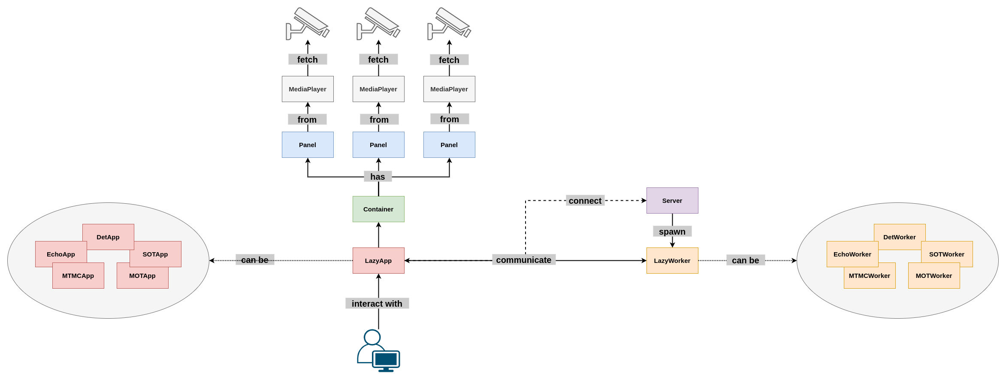
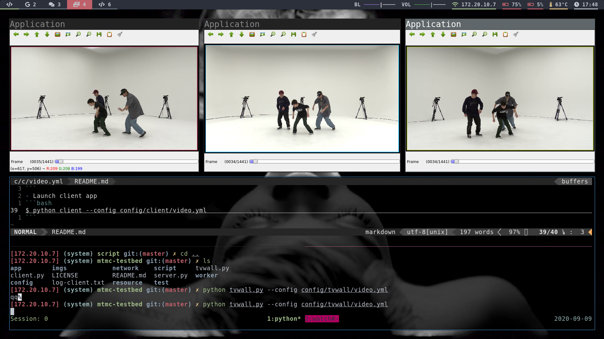
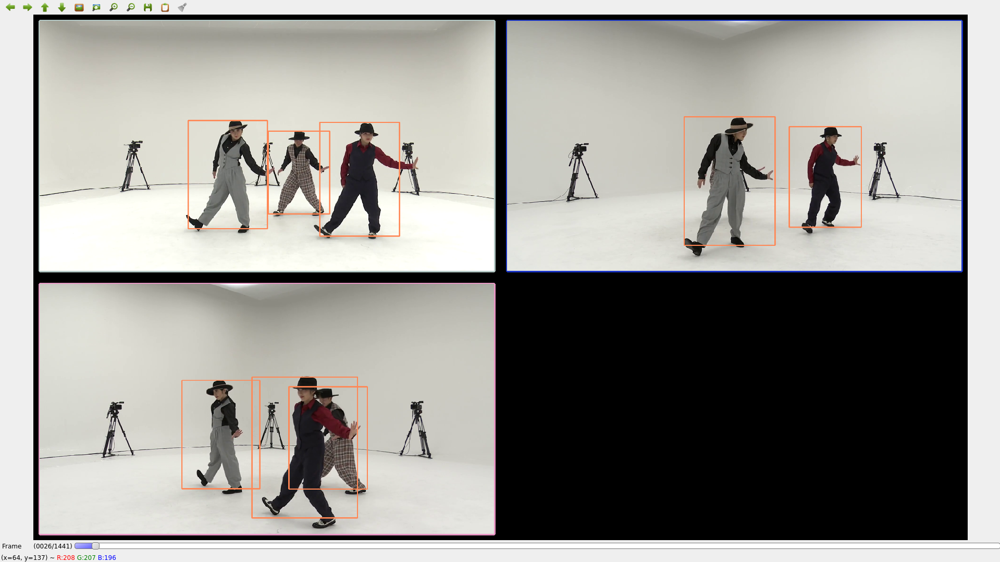

# mtmc-testbed

## Introduction
`mtmc-testbed` is a client-server platform mainly used for developing multi-target-multi-camera tracking algorithm with realtime observation.

The overall system is designed as a client-server platform. The system decouples the visualization and computing-intensive algorithm with visualization feature is at client-side, and algorithm is at server-side (with powerful gpus).

Following is the system architecture:


## Demonstration
- TV wall version (with echoworker)


- Regular version (with detworker)


## Example Dataset (AIST dataset)
- Download AIST video metadata list
```bash
$ cd resource/aist
$ wget https://aistdancedb.ongaaccel.jp/data/video_refined/10M/refined_10M_all_video_url.csv
```
- Download Popping videos (You can specifiy filter to download anything you want)
```bash
$ mkdir popping_ch01

# First use following command to check videos you want to downloads
# $ cat refined_10M_all_video_url.csv | grep gPO | grep sGR | grep ch01
$ cat refined_10M_all_video_url.csv | grep gPO | grep sGR | grep ch01 | xargs -I{} -P 4 wget {}
$ mv *.mp4 popping_ch01
```
- Change fps of videos (from 60 fps to 30 fps)
```bash
# Move to project root directory and execute following script
$ python script/change_video_fps.py --input_dir resoure/aist/popping_ch01
```

## Usage Guide
- Launch server first
```bash
$ python server --ip 0.0.0.0 --port 6666
```
- Launch client app
```bash
$ python client --config config/client/video.yml
```
